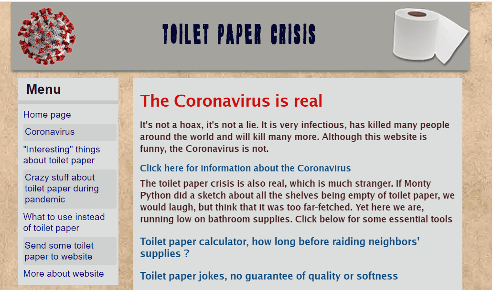

# Toilet paper crisis

A website dedicated to the glorious irony of toilet paper being sold out during the covid-19 crisis

Deployed at : https://tpapercrisis.com

Source code : https://github.com/johnlobster/tpcrisis (public access)

**John Webster**

Github : https://github.com/johnlobster

LinkedIn : https://www.linkedin.com/in/johnwwebster/

Portfolio : https://johnlobster.github.io/portfolio/

## Example

## Technologies

* react
* create-react-app
* react-router  
* html                                                                                                              
* sass and css                                                                                                              
* Typescript                                                                                                       
* GitHub                                                                                                            
* Bootstrap
* Trello (for planning)

## Design goals

* Static site (JAM stack)
* Single page app - fast user experience
* Small initial payload - fast first render for user
* Ability to send tips and send ideas/suggestions
* Animation
* Informal

## Deployment notes

Deployed on Netlify. Pushing to `release` branch on github will trigger a new deploy

## Technical and design details

[docs/TECH.md](docs/TECH.md)

